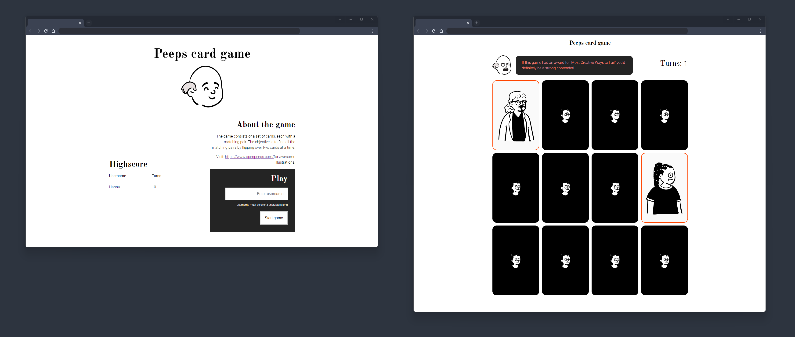

# Peeps - The card Game

This is was a personal learning project to create an memory card game using the cool illustrations from [Open Peeps](https://www.openpeeps.com/)  as the card designs. The project aimed to use React for the frontend development and incorporate Firebase as a simple backend for user and highscore management.

## The solution

Test the game with the URL below:

**⭐ Solution URL:** [https://www.jotto.dev/project/peeps-card-game/](https://www.jotto.dev/project/peeps-card-game/)

## Built with

- [React](https://reactjs.org/) - JS library
- [Vite](https://vitejs.dev/) - Frontend tooling
- Firebase - Backend

## Screenshots

